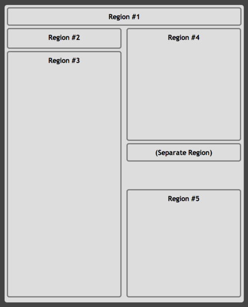
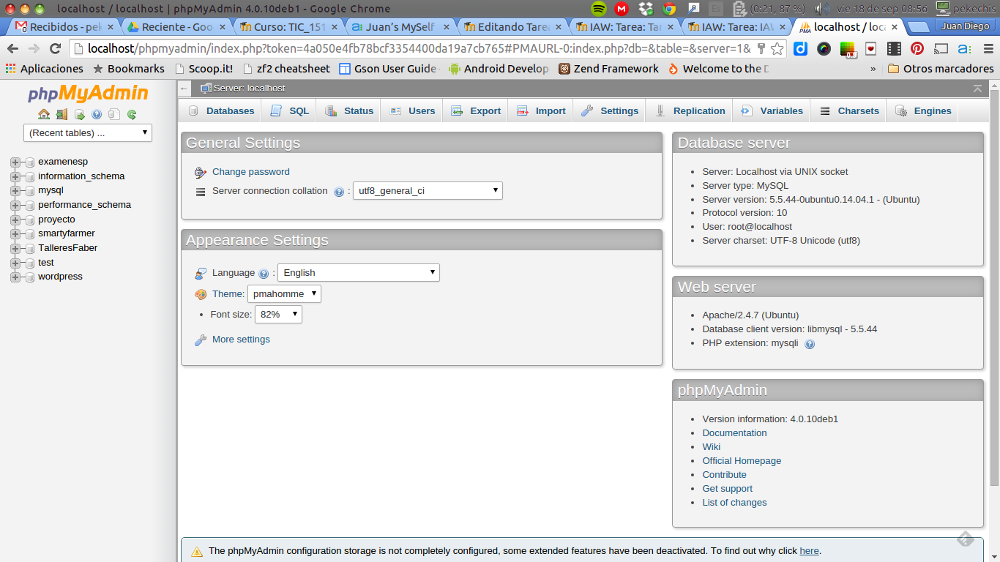

#Instalación de PHPMyAdmin
Una vez instalado la aplicación desde phpmyadmin debéis hacer lo siguiente:

- Crear el típico ejemplo de base de datos para un comercio (CLIENTE-PEDIDO-ARTÍCULO). Con sus relaciones, claves y todos los "extras". (Entregar los pantallazos que consideréis oportunos).

- Rellenar la base de datos con al menos 2 clientes, 5 pedidos y 3 artículos. (Entregar los pantallazos que creais oportunos).

- Exportar la base de datos y entregar el archivo resultante.

- En la pantalla de trabajo distinguir (examinando el css) cuáles es el nombre de las zonas principales y presentar eso a modo de layout CSS.

- Modificar uno de los temas de phpMyAdmin de tal manera que todo el fondo de la pantalla principal sea blanco y la cabecera de las secciones verde con la letra blanca. Para ello tendrás que buscar la localización del tema entre los ficheros de phpMyAdmin. (Adjuntar pantallazo)

Ejemplo de LayouCss. El tuyo debe ser similar y representar la pantalla principal de phpMyAdmin.

Pantalla principal de phpMyAdmin

NOTA: Si durante el proceso de instalación obtienes un error debes intenta solucionar por tí mismo. Hay un foro para intercambio de problemas en el curso. Ten cuidado con los requisitos de versiones que aquello que vayas a instalar. Se recomienda usar Linux.
